---
output:
  xaringan::moon_reader:
    css: [default, "slides-theme.css"]
    lib_dir: libs
    nature:
    ratio: '16:9'
    highlightStyle: github
    highlightLines: true
    slideNumberFormat: ''
    seal: false
---

# Exploring with integrity: making inferences with road crash data


```{r, include=FALSE}
library(tidyverse)
library(kableExtra)
library(icons)
```

`r icon_style(fontawesome("lock-open", style = "solid"), scale=.8)`
.small-font[OpenAccess Paper: [`10.1111/gean.12338`](https://onlinelibrary.wiley.com/doi/10.1111/gean.12338)] 
`r icon_style(fontawesome("code", style = "solid"), scale=.8)`
.small-font[Code Repo: [`github.com/...`](https://github.com/rogerbeecham/vis-inferences-roadsafety)]

<br/><br/><br/>

.right[
.tiny-font[Roger Beecham | School of Geography | University of Leeds]  <br/> `r icon_style(fontawesome("link", style = "solid"), scale=.6)`
.tiny-font[roger-beecham.com | ] `r icon_style(fontawesome("twitter"), scale=.6)` .tiny-font[rjbeecham]
]
---


### STATS19 Road Crash Data


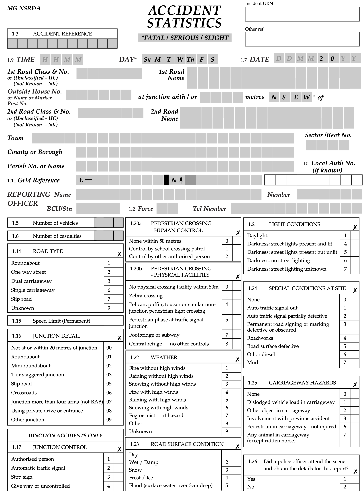</img>
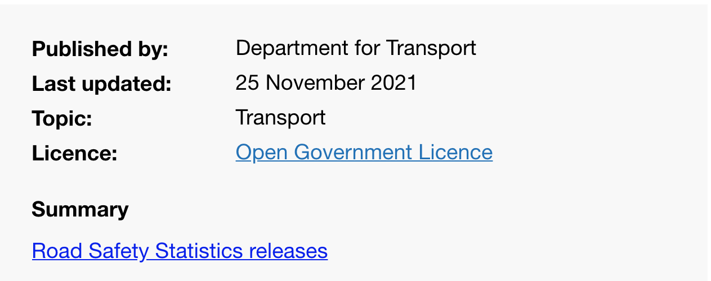</img>


???

Starting point :
* Every crash resulting in injury in UK is recorded
* Many variables

With DfT -- set of high-level ambitions :
* Knowledge around contributing factors to pedestrian and cycle casualties
* Monitoring and evaluating crash rates between reporting areas and over time

Identified numerous interesting and complex patterns from exploring data.
But ones that we have varying confidence in due to uncertainty around:
* dataset (collection)
* techniques and reporting

So quite difficult to *claim knowledge* -- or to know where to stop in our exploratory analysis.

---


### Geographical analysis

.tiny-font[
> The **replication** of spatial analysis is **complicated by the number of choices** that must be made during spatial analysis and the **wide range of alternatives** that could be reasonably pursued.


>  Kedron et al., 2021
]

???

Typical in a lot of Data Science-type work, certainly in geography, where repurposing data for analysis:

* analysis space is wide --
* looking at complex spatial processes where inferences are made about multiple features concurrently
---

### Geographical analysis


.tiny-font[
> The techniques of statistical inference have their origins in the work of agronomists and experimental psychologists, where research is often conducted on **samples** of individuals or plants that have been **drawn** [...] **independently from larger populations**. These techniques then allow inferences to be made about the larger population — in short, to **generalize away from the sample**.


> Nelson et al., 2022
]

???

Also the case that protocols for making statistical inference envisaged for very different situations.

---

### Geographical analysis


.tiny-font[
>  The techniques of statistical inference have their origins in the work of agronomists and experimental psychologists, where research is often conducted on **samples** of individuals or plants that have been **drawn** [...] **independently from larger populations**. These techniques then allow inferences to be made about the larger population — in short, to **generalize away from the sample**.
>
> [I]t is common in GIScience for research to deal not with a randomly chosen sample but with the **entire available set**: all of the counties in the United States, for example, or all of the census tracts in a city. In such situations **it is difficult to conceive of a larger population, difficult to see the set as randomly chosen from it, and difficult therefore to generalize away from the study**.


> Nelson et al., 2022
]

???

* and so where there is not agreed/accepted technique -- making inferential claims


---

### Scientific Reform


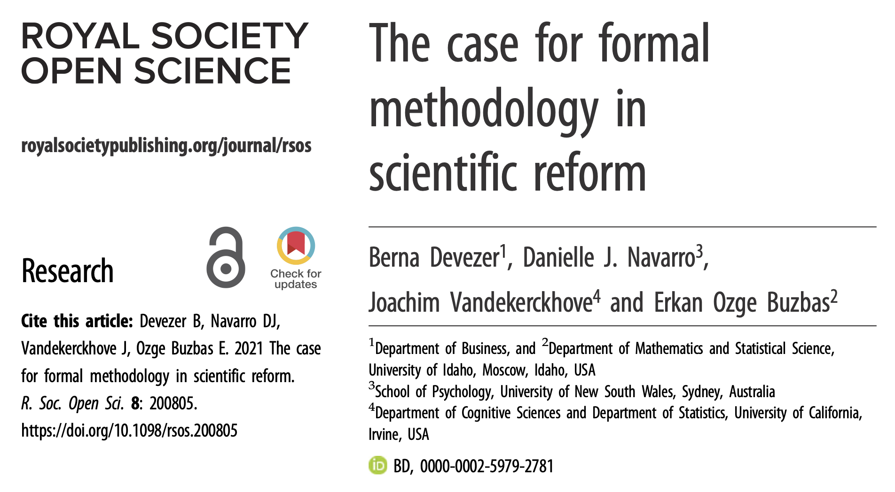</img>

<br><br><br><br><br><br><br><br><br>
.right[.tiny-font[**Claims of Scientific Reform (contested in this paper)**<br>
Reproducibility is the cornerstone of, or demarcation <br>
Using data more than once invalidates statistical inference (pre-registration) <br>
Exploratory research uses 'wonky' statistics
]]


???

This places Geog and our analysis in a difficult position given the current zeitgeist around scientific reform.

Science Reform and Replication crisis :


* Two discrete phases : Exploratory Data Analysis (EDA) and Confirmatory Data Analysis (CDA). That only through CDA statistical findings are claimed using out-of-sample hypothesis tests.

* But for the reasons I described, difficult to do. Pre-register, find other datasets.

Also:

* Pre-registration may lock researchers into faulty analysis plan -- does not guarantee statistical rigour. Pre-registration may *prevent* necessary/proper conditioning and may lead to staw-men null hypotheses.

* in this paper by Devezer et al. the key tenets/claims of the science reform movement are questioned -- along with their statistical validity.

* Key argument around the eda-cda dichotomy is that as it is about discovery EDA requires a broader approach analysis.
* But that it needs rigour to serve the intended prupose of scientific discovery -- it is about discovering *generalisations*. EDA is usually an iterative process of model specification, residual analysis, examination of assumptions, and model pre-specification... Whichever method is selected for EDA; however, it needs to be implemented rigorously to maximize the probability of true discoveries while minimizing the probability of false discoveries. Because the process of exploration is elusive and informal, it may not be possible to derive some minimum standards all exploratory studies need to meet.

1. exploratory research cannot be reduced to EDA. But
2. But when it is pursued it needs rigour and formal justifications


*  Nonetheless, some desirable qualities can be inferred from successful implementation of exploratory approaches in different fields: (i) as suggested by Russell’s quote, exploration needs to start with subject matter expertise or theoretical background, and hence, cannot be decontextualized, free of theory, or completely dictated by the data [83,102,104,105,111,113]; (ii) the key for running successful exploratory studies is the richness of data [122]. Random datasets that are uninformative about the area to be explored will probably not yield important discoveries; (iii) exploration requires robust methods that are insensitive to underlying assumptions [105]. As such, rather than misusing or abusing standard procedures for inferential statistics, using robust approaches such as multiverse analysis [86] or metastudies [123] could be more appropriate for exploration purposes; and (iv) exploratory work needs to be done in a structured, systematic, honest and transparent manner using a deliberately chosen methodology appropriate for the task [10,122].


Wagenmakers et al. [13, p. 634] argue that purely exploratory research is one that finds hypotheses in the data by post hoc theorizing and using inferential statistics in a ‘wonky’ manner (borrowing Wagenmakers et al.’s [13] terminology) where p-values and error rates lose their meaning:

* Reproducibility -- analogous to replication here as not about transparency of methods. E.g providing sufficient details to reproduce results -- true results can be regularly reproduced, true false results can be regularly reproduced.


---

### Exploratory analysis and visualization

</img>

</img>

<br><br><br><br><br><br><br><br><br><br>

.xtiny-font[
> EDA is often thought of as an alternative to model-based statistical analysis, but once we think of graphs as comparisons to models, it makes sense that the amount we've learned increases with the complexity of the model being compared to
>
> Hullman and Gelman 2021
]


???

Interesting discussion from the vis / applied stats community about an enlarged EDA which is more model-focussed and concerned with generating complex models that also sensitive to false discovery.

Reformulates exploratory analysis (not EDA) as an explicitly model-based activity. Concerned with analysing observed patterns against candidate data generating processes. Graphics are essential to this: Graphics invite us to form comparisons and expectations -- and characterising variation from those expectations.


---

### Framework: explore with integrity

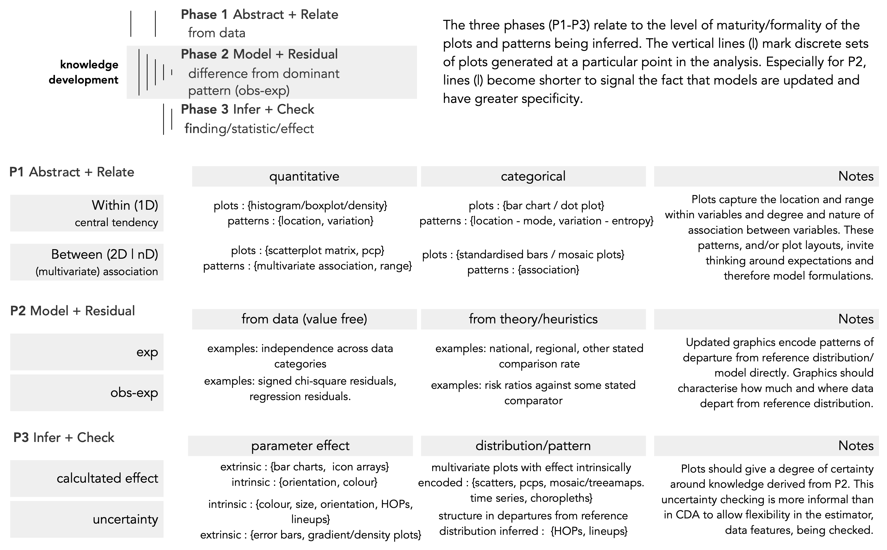</img>


???

.tiny-font[
> 1. exploratory research cannot be reduced to EDA. But
> 2. But when it is pursued it needs rigour and formal justifications
>
> Devezer et al., 2021
]

???

Framework for what this expanded, model-based exploratory analysis (not EDA) might involve.

* Three phases.


 But that it needs rigour to serve the intended prupose of scientific discovery -- it is about discovering *generalisations*. EDA is usually an iterative process of model specification, residual analysis, examination of assumptions, and model pre-specification... Whichever method is selected for EDA; however, it needs to be implemented rigorously to maximize the probability of true discoveries while minimizing the probability of false discoveries. Because the process of exploration is elusive and informal, it may not be possible to derive some minimum standards all exploratory studies need to meet.


---


### Framework: case studies

.xtiny-font[Data analysis 1: Pedestrian crashes and neighbourhood characteristics]
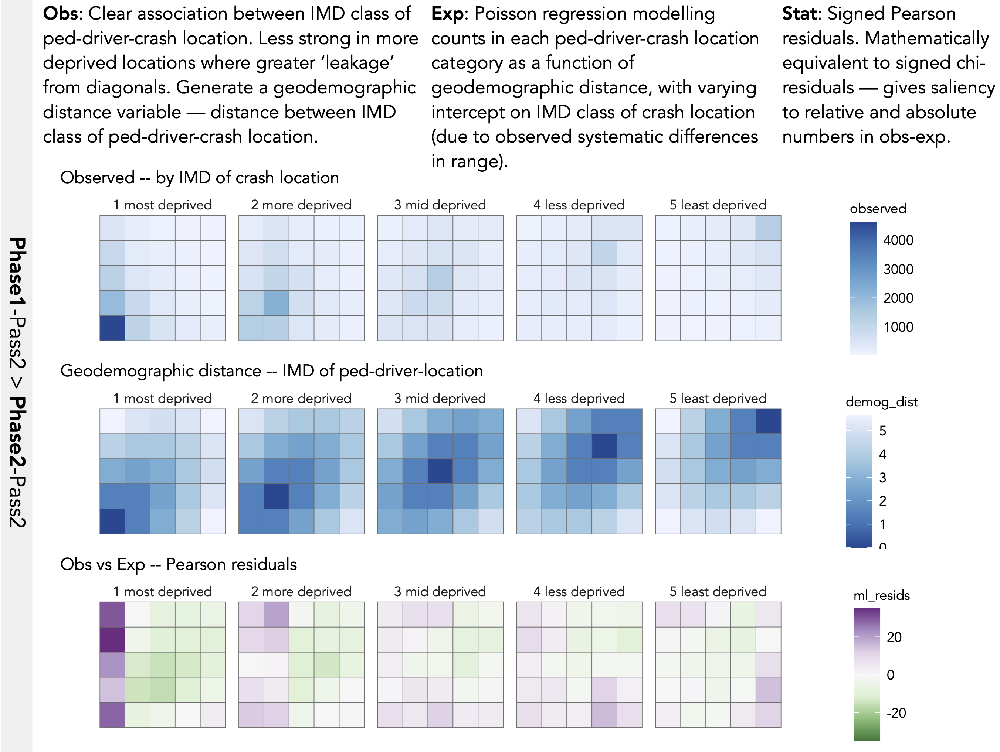</img>

<br><br><br><br><br>


</img>


---


### Framework: case studies

.xtiny-font[Data analysis 2: Pedestrian crashes authority comparison]
</img>

<br><br><br><br><br>


</img>


---


### Framework


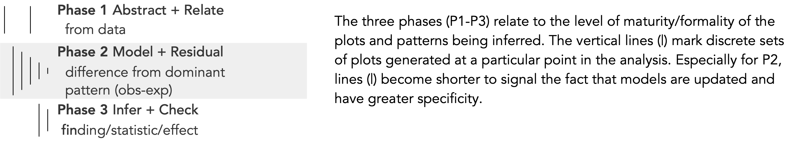</img>


---

### Abstract + Relate


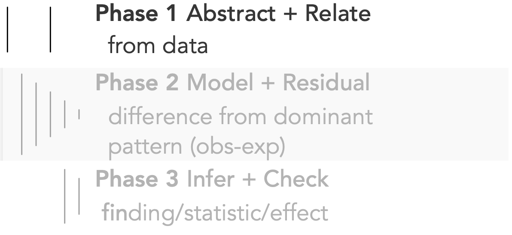</img>

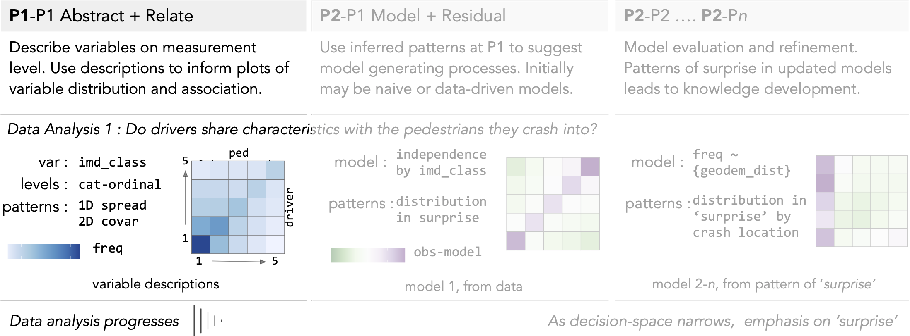</img>

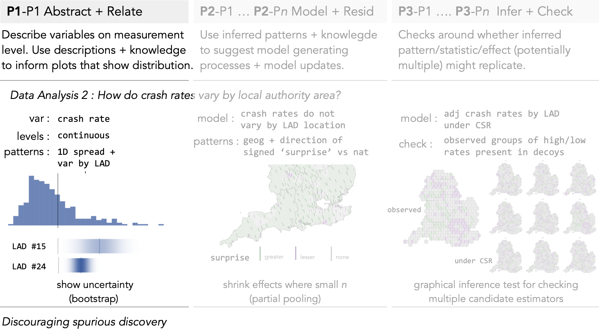</img>
---

### Model + Residual


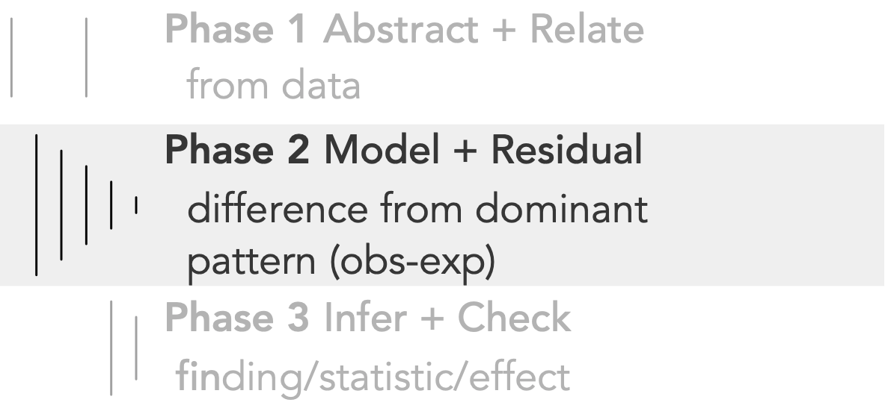</img>

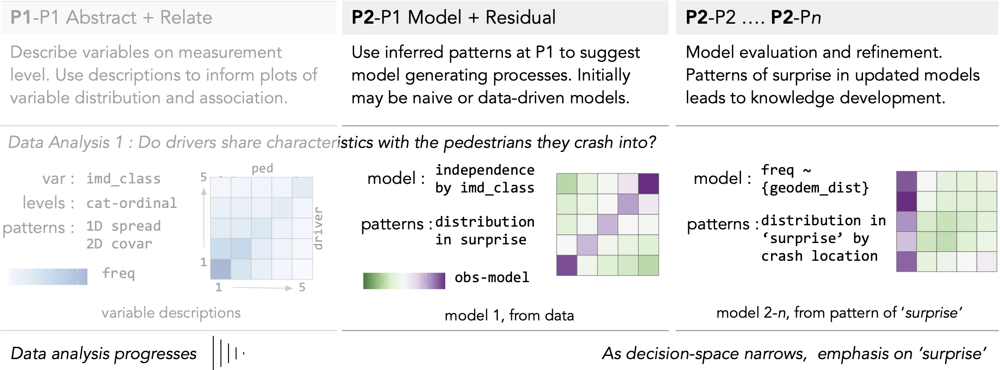</img>

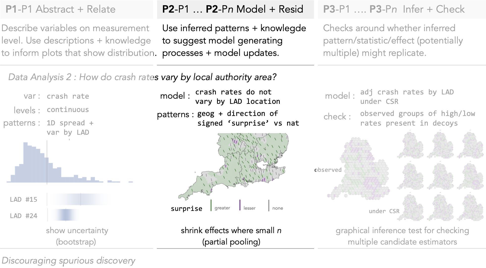</img>
---

### Infer + Check


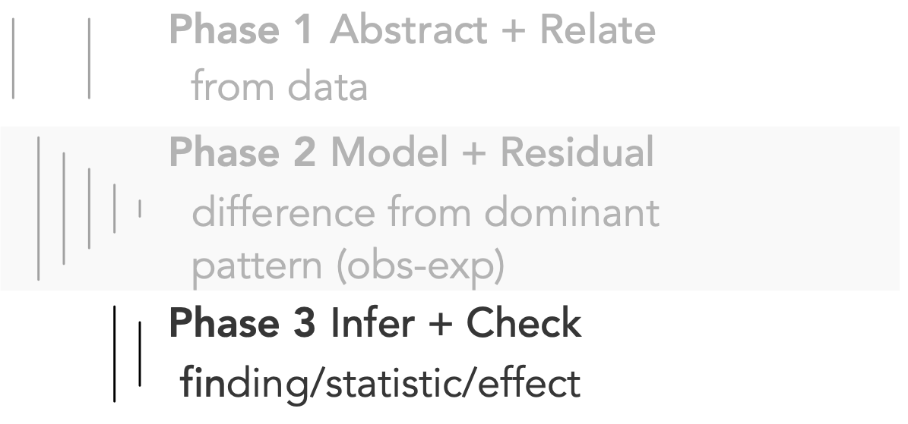</img>

<br><br><br><br><br><br><br><br><br>
.left[.xtiny-font[
>  *Exploratory research **needs rigor** to serve its intended aim of **facilitating scientific discovery**.* <br>
 *Whichever method is selected [...] it needs to be implemented rigorously to **maximize the probability of true discoveries while minimizing the probability of false discoveries**. *
>
>  Devezer et al. 2021
]]

</img>

---


### Model refinement and characterising 'surprise'

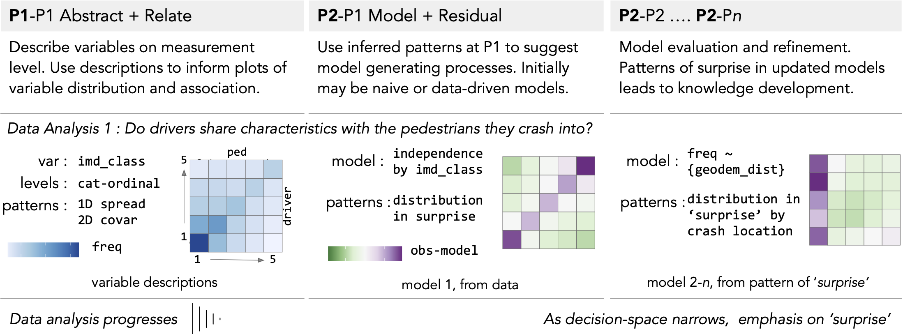</img>


---

### Model refinement and characterising 'surprise'

</img>


---

### Model refinement and characterising 'surprise'

</img>


---

### Model refinement and characterising 'surprise'

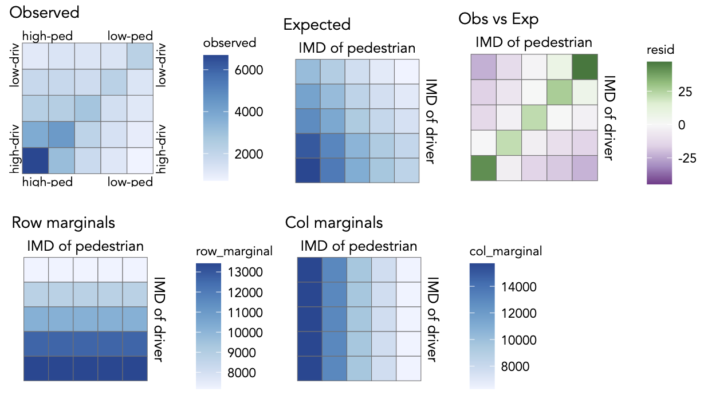</img>


---


### Model refinement and characterising 'surprise'

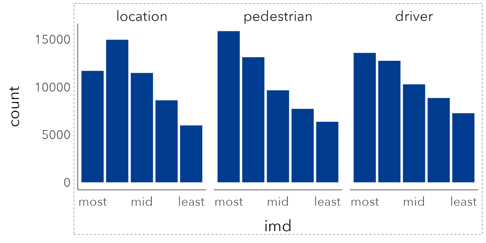</img>

---

### Model refinement and characterising 'surprise'

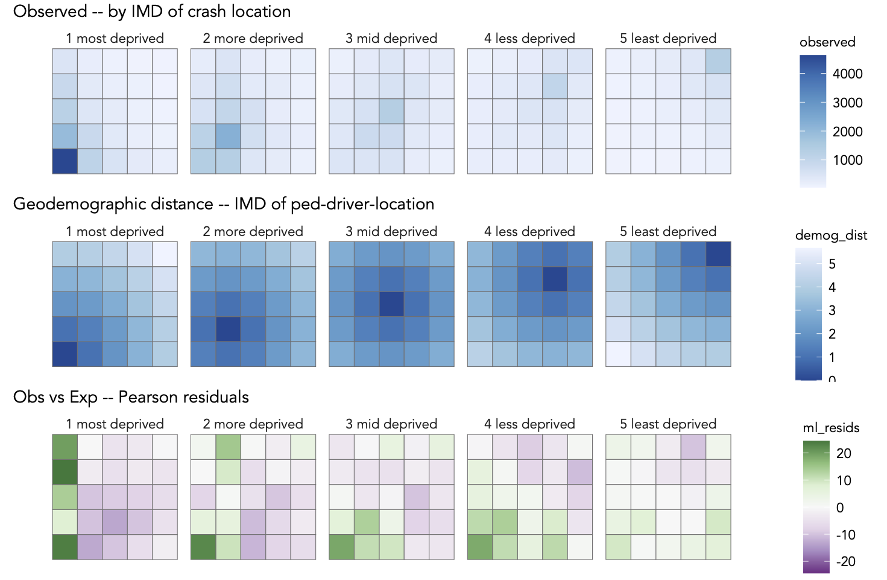</img>


---

### Designing-out spurious discovery

</img>

---

### Designing-out spurious discovery

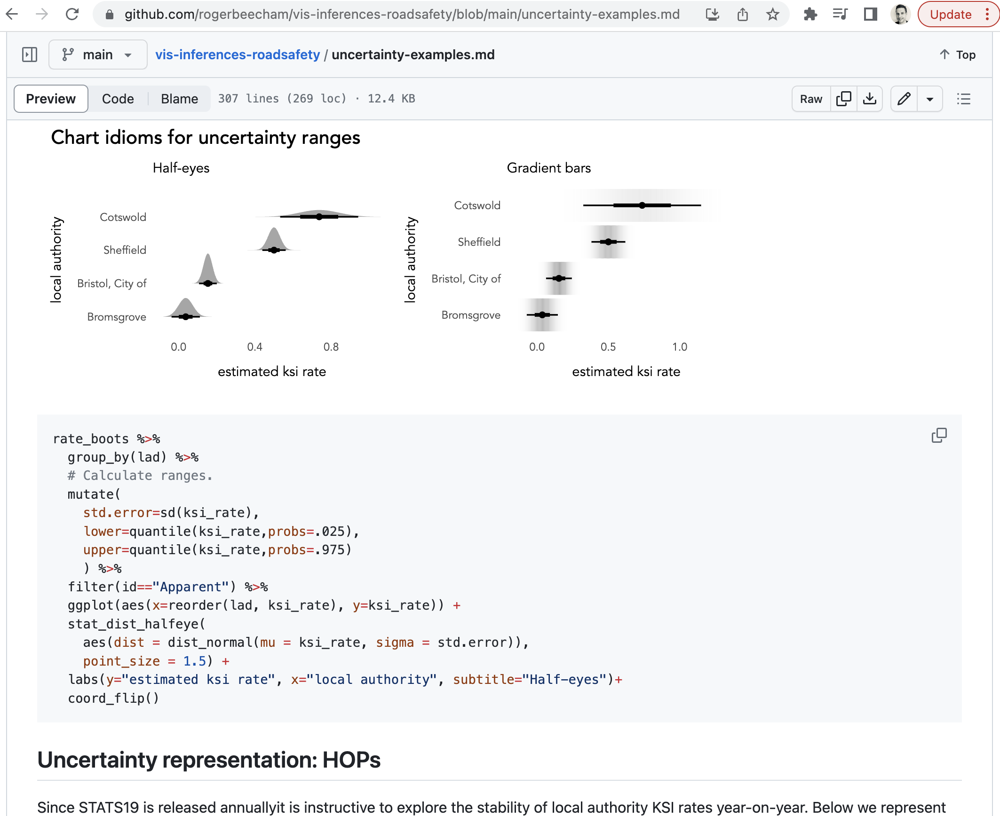</img>

---

### Frequency framing

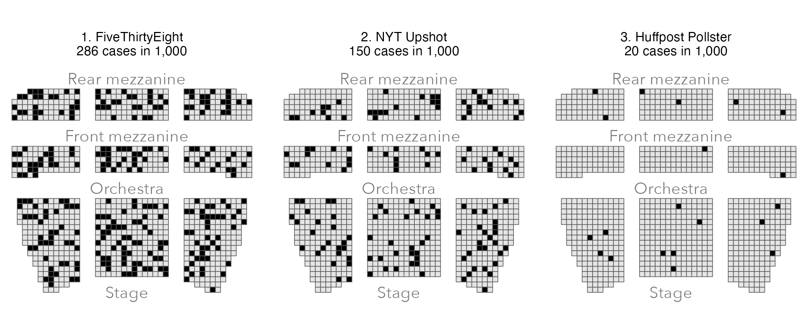</img>

---

### Frequency framing

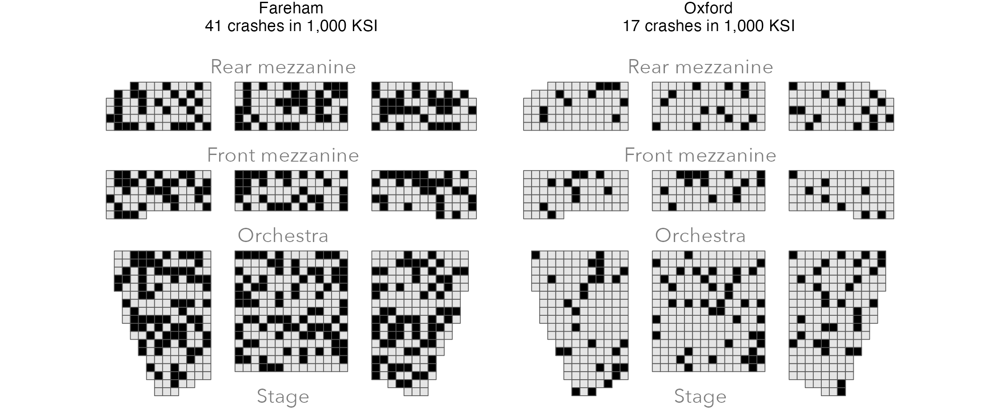</img>

---

### Links

`r icon_style(fontawesome("lock-open", style = "solid"), scale=.8)`
.small-font[OpenAccess Paper: [`10.1111/gean.12338`](https://onlinelibrary.wiley.com/doi/10.1111/gean.12338)] 
`r icon_style(fontawesome("code", style = "solid"), scale=.8)`
.small-font[Code Repo:  [`github.com/...`](https://github.com/rogerbeecham/vis-inferences-roadsafety)]


-----


`r icon_style(fontawesome("lock-open", style = "solid"), scale=.8)`
.small-font[CRC Press Book: [`In progress`](https://vis4sds.github.io/vis4sds/)] 
`r icon_style(fontawesome("code", style = "solid"), scale=.8)`
.small-font[R packages:  [`gridmappr`](https://www.roger-beecham.com/gridmappr/index.html)]


